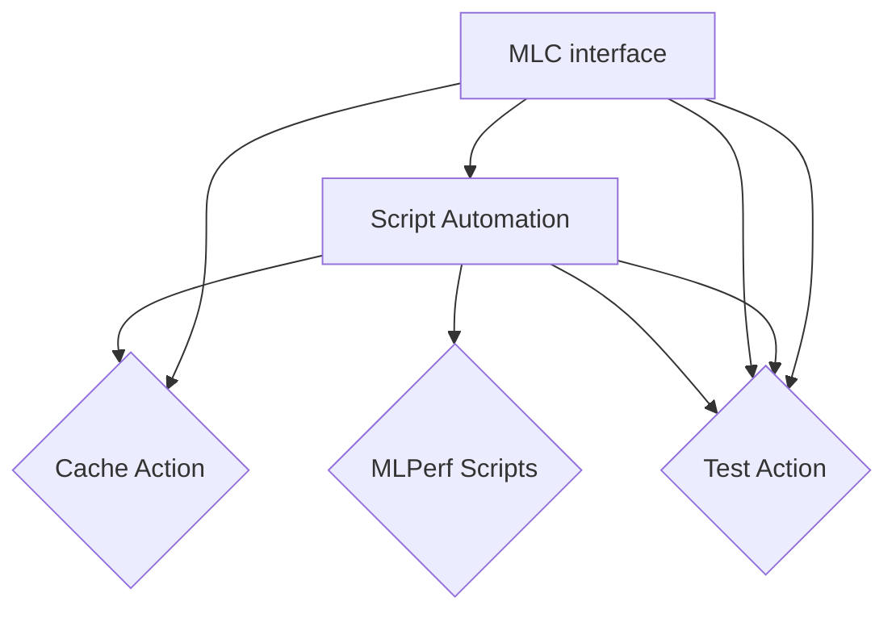

# MLC script automation workflow 

```mermaid
flowchart TD
    A[MLC interface] --> B{Script Automation}
    A[MLC interface] --> C{Cache Action}
    B[Script Automation] --> C{Cache Action}
    A[MLC interface] --> E{Docker Action}
    B[Script Automation] --> E{Docker Action}
    A[MLC interface] --> E{Test Action}
    B[Script Automation] --> E{Test Action}
    B[Script Automation] --> D{MLPerf Scripts}
```
